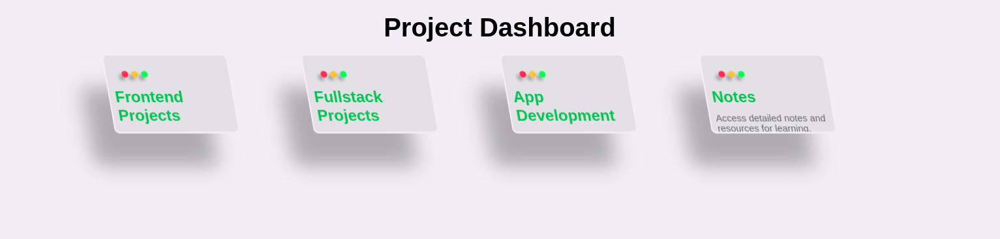

# Project Dashboard

A responsive and interactive dashboard showcasing various project categories: **Frontend Projects**, **Fullstack Projects**, **App Development**, and **Notes**. Each category is represented as a card with descriptive text and a button for further action.

---

## Features

- **Responsive Design**: Adapts seamlessly to different screen sizes using a grid layout.
- **Interactive Cards**: Hover animations and click-ready buttons.
- **Modern Styling**: Minimalistic and user-friendly design with clean aesthetics.
- **Customizable**: Easily extendable to add more cards or features.

---

## Technologies Used

- **HTML5**: Structure and layout.
- **CSS3**: Styling and responsiveness.
- **JavaScript (Optional)**: Add interactivity (e.g., button actions).

---

## Installation and Setup

1. Clone or download the repository:
   ```bash
   git clone https://github.com/yourusername/project-dashboard.git
Navigate to the project directory:

```cd project-dashboard```
Open the index.html file in your browser to view the dashboard.
#File Structure


~~~project-dashboard
│
├── index.html       # Main HTML file
├── style.css        # CSS for styling the dashboard
└── script.js        # Optional JavaScript for interactivity
~~~
How to Use
Each card represents a project category:
Frontend Projects: Focuses on UI/UX and client-side development.
Fullstack Projects: Covers both frontend and backend projects.
App Development: Includes mobile and desktop app projects.
Notes: Provides resources and learning material.
Click on the View button in each card to proceed (currently, buttons can be linked to specific pages).
Customization
To Add a New Card:

Open index.html.
Copy an existing card's code block and modify the content.
To Update Styles:

Open style.css.
Adjust colors, fonts, or layout as needed.
Contribution
Contributions are welcome! If you find a bug or have an idea for improvement, feel free to fork the repo and submit a pull request.

License
This project is licensed under the MIT License.


### Notes:
- Replace `https://github.com/programerpj69/project-dashboard.git` with your actual repository link if hosted on GitHub.
- If you plan to include a `LICENSE` file, you can use the MIT license or any other applicable license. Let me know if you need help generating one!

# view

